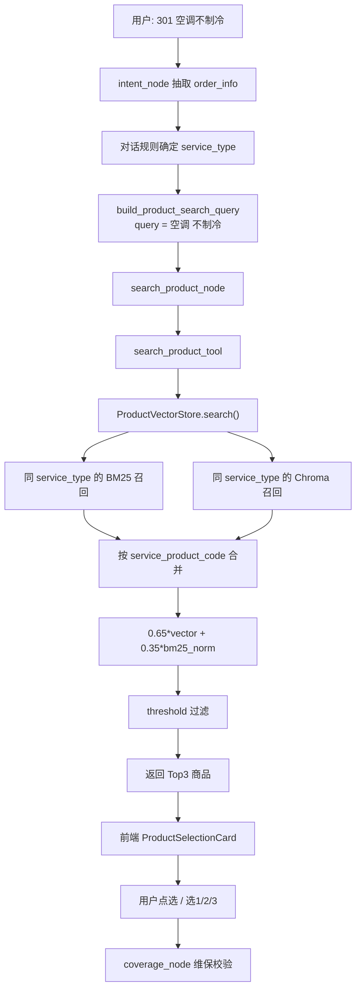

# 商品混合检索（BM25 + Chroma）

## 文档说明

本文档描述酒店 AI 下单 Agent 中的**商品匹配 / 商品检索**实现。系统从 `assets/spu.xlsx` 读取标准商品（SPU），通过 **BM25 关键词召回** 与 **Chroma 向量语义召回** 两路并行检索，融合排序后返回 Top3 候选供用户选择。

旧文档名 `embedding_recall.md` 仅强调 embedding，已不能覆盖当前 BM25 + 向量混合检索的实现，故更名为本文档。

---

## 一、目标与边界

### 目标

1. 根据用户自然语言中的**商品/设备**和**故障现象**，检索最匹配的标准可下单商品。
2. 匹配结果的 `service_order_type` 用于推断本次订单的 `service_type`（托管维修、单次维修、单次安装、单次测量等）。
3. 返回 Top3 候选给前端商品卡片，**不自动选中 Top1**，由用户确认后再进入预下单流程。

### 不在本文档范围

- 维保范围校验（`coverage_node`）
- 预下单字段校验与提交（`validate_order_node` / `submit_node`）
- LLM 意图识别与字段抽取（`intent_node`）

---

## 二、技术栈概览

| 组件 | 作用 | 存储 / 依赖 |
|------|------|-------------|
| Qwen `text-embedding-v4` | 将文本向量化，供 Chroma 语义检索 | DashScope `/embeddings` API |
| Chroma | 向量存储与余弦相似度检索 | 本地持久化 `data/chroma_db/` |
| BM25（`rank-bm25`） | 商品名关键词召回与打分 | 进程内内存，每次启动重建 |
| jieba | 中文分词，为 BM25 提供 token | 无外部依赖 |
| `openpyxl` | 读取 Excel 商品数据 | `assets/spu.xlsx` |

**重要说明**：BM25 在本项目中通过 `rank-bm25` 在进程内实现，**不依赖 Elasticsearch**。Elasticsearch 只是 BM25 的一种工程化承载方式（自带倒排索引、分词、BM25 打分、运维能力）；当前商品规模下，内存 BM25 已足够。

---

## 三、BM25 与 Chroma：核心技术点对比

| 维度 | BM25 | Chroma 向量检索 |
|------|------|-----------------|
| **检索类型** | 关键词 / 稀疏检索 | 语义 / 稠密向量检索 |
| **匹配依据** | 词是否出现、词频、文档长度 | 文本语义是否相近 |
| **索引内容** | 分词后的 token 倒排 | 高维 embedding 向量 |
| **分词/编码** | jieba 搜索模式切词 | Qwen embedding 向量化 |
| **擅长** | 字面强匹配，如「空调」「门锁」 | 同义、口语、近义表达 |
| **弱点** | 同义词、口语说法 | 字面弱但关键词明确的场景 |
| **存储** | 进程内内存，启动时重建 | 本地持久化 `data/chroma_db/` |
| **外部依赖** | 无 | 需要 embedding API |
| **延迟** | 极低（内存计算） | 需调用 embedding API + 向量检索 |

### BM25 的核心原理

BM25（Best Matching 25）是一种经典的关键词相关性排序算法。它回答的问题是：**query 里的词，在文档里出现了多少、有多稀有、文档是否过长**。

简化理解：

```text
query: 空调 漏水
文档 A 商品名: 空调(小修)     → 「空调」命中 → BM25 分高
文档 B 商品名: 水柜(中修)     → 无共同词     → BM25 分为 0
```

BM25 不会理解「马桶」和「坐便器」是同义词，除非词表里恰好都有对应 token。

### Chroma 向量检索的核心原理

Chroma 存储的是 embedding 向量。检索时：

1. 把 query 文本通过 Qwen embedding 变成向量。
2. 在向量空间中找与 query 向量**余弦相似度最高**的商品。
3. 语义相近的文本，即使字面不同，也可能排在前面。

例如用户说「马桶堵了」，商品名是「坐便器疏通」——向量检索可能比 BM25 更有机会命中。

### jieba 与 BM25 的关系

二者不是同一层的东西，通常是配合使用：

```text
原始中文文本
  → jieba 分词（cut_for_search）
  → 得到 token 列表
  → BM25 用 token 计算相关性分数
  → 返回关键词检索排序结果
```

- **jieba**：中文分词工具，负责把句子拆成词。
- **BM25**：排序算法，负责根据 token 匹配程度打分。

在本项目中，jieba 只为 BM25 服务；Chroma 检索不经过 jieba，直接走向量 embedding。

---

## 四、实现上的关键区别

### 4.1 索引字段不同

**Chroma 向量索引文本**（`build_product_index_text`）：

```text
{服务商品名称} {关联故障现象}
```

- 维修类：例如 `空调(小修) 不制冷 噪音大`
- 安装/测量类：通常只有商品名，无故障现象

**BM25 索引文本**：

- **仅** `service_product_name`（服务商品名称）
- 不含故障现象，更偏向「商品名字面命中」

这样设计的原因：

- 向量侧需要故障语义，帮助区分「空调维修」和「空调安装」。
- BM25 侧聚焦设备名，避免故障高频词（如「漏水」「损坏」）稀释商品名权重。

### 4.2 索引构建时机不同

| 索引 | 何时构建 | 是否持久化 |
|------|----------|------------|
| BM25 | 每次 `load_products()` 从 Excel 重建 | 否，纯内存 |
| Chroma | Excel / embedding 模型 / 索引版本变化时重建 | 是，`data/chroma_db/` |

Chroma 重建条件记录在 `data/chroma_db/build_metadata.json`：

```json
{
  "excel_mtime": 1234567890.0,
  "excel_size": 12345,
  "embedding_model": "text-embedding-v4",
  "index_text_version": "product-name-fault-v2"
}
```

任一条件变化时触发 Chroma 全量重建；BM25 无论 Chroma 是否重建，都会随启动重新构建。

### 4.3 检索过程不同

**Chroma**：

```python
vector_results = self.vector_store.similarity_search_with_relevance_scores(query, k=fetch_k)
```

- query 原文（如 `空调 漏水`）直接送 embedding。
- 在向量库中按 relevance score 取 Top `fetch_k`。

**BM25**：

```python
query_tokens = _tokenize_for_bm25(query)  # jieba 分词
scores = self._bm25.get_scores(query_tokens)
# 取 Top fetch_k 且 score > 0 的文档
```

- query 先分词，再对**全量商品名**算 BM25 分。
- 取得分 > 0 的 Top 候选。

### 4.4 分数含义与融合方式不同

| 分数类型 | 范围 | 含义 |
|----------|------|------|
| Chroma relevance score | 大致 0–1 | 语义相似度 |
| BM25 原始分 | 无固定上界 | 关键词匹配强度 |
| BM25 归一化分 | 0–1 | 本轮候选内按最大值归一化 |
| 最终融合分 | 两路分数加权结果 | 排序依据 |

融合公式（`rag/product_store.py`）：

```text
final_score = 0.65 * vector_score + 0.35 * bm25_norm
```

常量：

```python
VECTOR_SCORE_WEIGHT = 0.65
BM25_SCORE_WEIGHT = 0.35
```

设计意图：**向量仍是主排序信号（65%）**，BM25 负责把字面强匹配商品往前推（35%）。

---

## 五、在项目里如何协作

### 5.1 端到端链路



### 5.2 上游：query 怎么来

入口：`graph/products.py` → `build_product_search_query()`

```python
def build_product_search_query(order_info, service_type=None):
    product = order_info.get("product")
    fault = order_info.get("fault")
    service_hint = {"单次安装": "安装", "单次测量": "测量"}.get(service_type)
    return " ".join(str(v) for v in [product, fault, service_hint] if v)
```

示例：

| 用户输入 | order_info | 检索 query |
|----------|------------|------------|
| 「1208 空调不制冷」 | product=空调, fault=不制冷 | `空调 不制冷` |
| 「帮我安装洗衣机」 | product=洗衣机, fault=空 | `洗衣机 安装` |
| 「水龙头漏水」 | product=水龙头, fault=漏水 | `水龙头 漏水` |

`search_product_node` 会传入对话确定的 `service_type` 做精确过滤。

### 5.3 中游：`ProductVectorStore.search()` 详细步骤

实现文件：`rag/product_store.py`

```text
Step 1  预处理
        query.strip()，空则返回 []
        fetch_k = top_k * 4（默认 top_k=3 → fetch_k=12）

Step 2  服务类型过滤 + 双路召回（并行逻辑，无先后依赖）
        BM25:  同 service_type 文档 → jieba 分词 → get_scores → Top fetch_k（score>0）
        Chroma: service_type metadata filter → Top fetch_k

Step 3  候选合并
        按 service_product_code 去重
        同 code 保留 max(vector_score) 和 max(bm25_score)

Step 4  BM25 归一化
        bm25_norm = bm25_score / max(bm25_score in candidates)

Step 5  融合打分
        final = 0.65 * vector_score + 0.35 * bm25_norm

Step 6  排序 + 截断 + 阈值
        按 final 降序，取 top_k
        丢弃 final < PRODUCT_SEARCH_THRESHOLD（默认 0.3）
```

**只被一路召回的商品**仍可进入候选池：另一路分数为 0。例如 BM25 命中但向量未进 Top12 的商品，仍可能因 BM25 分获得最终排名。

### 5.4 各自在项目中的「角色」

| 用户说法 | BM25 更擅长 | Chroma 更擅长 |
|---------|------------|--------------|
| `空调 漏水` | 商品名含「空调」的排前 | 「不制冷」「漏水」等故障语义 |
| `马桶 堵了` vs 商品名「坐便器」 | 字面可能弱 | 语义可能更强 |
| `门锁 打不开` | 「门锁」字面命中 | 「打不开」「损坏」等近义故障 |
| `洗衣机 安装` | 「安装」若不在商品名则弱 | 结合商品名理解安装类意图 |

一句话概括：

- **BM25**：负责「用户说的词，和标准商品名是否对得上」。
- **Chroma**：负责「用户口语描述，和标准商品语义是否接近」。
- **融合排序**：把两路优势合并，再应用业务阈值。

### 5.5 业务规则：service_type 精确过滤

检索前先根据对话规则确定 `service_type`，BM25 和 Chroma 都只召回该类型商品。

**典型场景**：用户说「水龙头漏水」时，类型为托管维修，安装和测量商品不会进入候选池。

因此无需再通过额外扣分区分维修、安装和测量。

### 5.6 下游：结果怎么用

1. `search_product_node` 拿到 Top3，写入 state `products`。
2. `phase` 变为 `product_selection`，前端展示商品卡片。
3. **不会自动选中 Top1**；`selected_product_code` 为空时进入 `ask_node` 引导选择。
4. 用户点选卡片（`/select-product`）或输入「选1/2/3」后，才进入 `coverage_node` → 预下单。
5. `service_type` 已在检索前由对话规则确定，商品候选不能覆盖它。

---

## 六、与旧实现的区别

### 旧实现（重构前）

```text
Chroma 向量召回
  → jieba 关键词重叠硬过滤（商品名与 query 无共同 token 则丢弃）
  → 过滤不足时回退纯向量
  → 返回 TopK
```

问题：硬过滤会误杀同义表达（如「马桶」vs「坐便器」），且 README 写「BM25」但实际没有 BM25 索引。

### 新实现（当前）

```text
service_type 精确过滤
  → BM25 召回 + Chroma 召回
  → 按商品 code 合并
  → 分数融合（0.65 vector + 0.35 bm25）
  → threshold 过滤
  → 返回 TopK
```

改进：

- 真正引入 `rank-bm25` 内存索引。
- 不再硬过滤，同义词可依赖向量兜底。
- BM25 通过加权影响排序，而不是「有/无」二元过滤。

---

## 七、为什么不引入 Elasticsearch

| 对比项 | 进程内 rank-bm25 | Elasticsearch |
|--------|------------------|---------------|
| BM25 能力 | 有 | 有（默认相关性算法） |
| 部署 | 无额外服务 | 需独立集群 |
| 索引更新 | 启动时从 Excel 重建 | 需同步管道 |
| 适用规模 | 数百～数千商品 | 十万级以上更合适 |
| 代码量 | ~80–180 行 | ~400–800 行（含运维） |

**结论**：BM25 ≠ 必须上 ES。ES 是 BM25 的工程化承载；当前 Excel + 本地 Chroma 架构下，内存 BM25 更合适。

---

## 八、检索参数与配置

### search_product_tool 参数

| 参数 | 类型 | 说明 |
|------|------|------|
| `query` | string | 检索 query，通常 `product + fault` |
| `top_k` | int | 返回候选数，节点侧默认 3 |
| `threshold` | float \| null | 融合分阈值，null 时用 `PRODUCT_SEARCH_THRESHOLD` |
| `service_type` | string \| null | 只召回指定服务订单类型的商品 |

### 环境变量（`.env`）

```env
SPU_EXCEL_PATH=assets/spu.xlsx
QWEN_EMBEDDING_MODEL=text-embedding-v4
QWEN_EMBEDDING_BASE_URL=https://dashscope.aliyuncs.com/compatible-mode/v1
QWEN_EMBEDDING_API_KEY=
PRODUCT_SEARCH_THRESHOLD=0.3
```

融合权重当前为模块常量，后续可按 golden set 调参后迁入 `config/settings.py`。

---

## 九、Tool 接口示例

入口：`tools/product_search.py` → `search_product_tool`

**请求**：

```json
{
  "query": "马桶 堵塞",
  "top_k": 3,
  "threshold": null,
  "service_type": "托管维修"
}
```

**响应**：

```json
{
  "status": "success",
  "data": {
    "query": "马桶 堵塞",
    "products": [
      {
        "score": 0.8231,
        "service_product_code": "FWSP00001",
        "service_product_name": "马桶疏通",
        "service_order_type": "单次维修服务",
        "fault_phenomenon": "堵塞"
      }
    ],
    "count": 1
  }
}
```

---

## 十、方案演进与设计决策

### 10.1 为什么引入 BM25

**问题**：纯向量检索时，「空调漏水」可能把「水柜(中修)」排到第一（相似度 ~48%），空调商品只有 ~44%。

**根因**：「漏水」在向量空间与「水系统」商品语义高度相关，故障词权重压过设备名「空调」。

**方案**：BM25 对商品名建内存索引，与 Chroma 各自召回，再融合排序。BM25 把含「空调」的商品往前推，向量保留语义兜底。

### 10.2 为什么移除额外故障降权参数

**问题**：「水龙头漏水」时，安装类商品（无故障文本）与维修类商品 BM25/向量分接近。

**当前方案**：先按对话确定的 `service_type` 精确过滤，再做混合排序。跨类型商品不会进入候选池，因此额外的故障降权参数已经冗余并被移除。

### 10.3 为什么不引入 Reranker

Reranker（Cross-Encoder）在宽召回后用另一模型对 (query, doc) 整体重排。

| 优点 | 缺点 |
|------|------|
| 减少手工规则 | 延迟 +100~500ms |
| 泛化长尾 query | 额外模型依赖 |
| 细粒度区分更准确 | 可解释性下降 |

当前商品库规模有限、结构规整，BM25 + 向量 + 简单规则已够用。商品库扩展到数千条或出现大量规则覆盖不了的长尾 query 时再评估。

---

## 十一、相关代码与测试

| 文件 | 职责 |
|------|------|
| `rag/product_store.py` | BM25 + Chroma 混合检索主实现 |
| `rag/spu_loader.py` | Excel 加载与服务类型归一化 |
| `rag/qwen_embedding.py` | Qwen embedding 客户端 |
| `tools/product_search.py` | `search_product_tool` 工具入口 |
| `graph/builder.py` | `search_product_node` 编排 |
| `graph/products.py` | query 构造、反馈文案 |
| `tests/test_product_recall_keyword.py` | BM25 / 融合纯逻辑单测 |
| `tests/test_product_search_tool.py` | 工具透传单测 |
| `tests/test_product_recall_eval.py` | golden set 评测（`@pytest.mark.embedding`） |

### 验证命令

```bash
# 纯逻辑单测（无需 embedding）
uv run pytest tests/test_product_recall_keyword.py tests/test_product_search_tool.py tests/test_product_search_query.py

# golden set（需 Qwen embedding + chroma_db）
uv run pytest -m embedding tests/test_product_recall_eval.py
```

### 建议手工验证 query

- `空调 漏水`
- `水龙头 漏水`
- `门锁 打不开`
- `洗衣机 安装`
- `马桶 堵了`

---

## 十二、排查指引

| 现象 | 可能原因 | 排查方向 |
|------|----------|----------|
| 返回空列表 | 融合分均低于 threshold | 降低 `PRODUCT_SEARCH_THRESHOLD` 或检查 query 是否过短 |
| 设备名对但排名靠后 | 向量侧被故障词带偏 | 看 BM25 分是否正常；考虑调权重 |
| 安装/测量/维修混淆 | service_type 未传或商品元数据错误 | 检查关键词分类结果和 `search_product_node` 的 `service_type` 参数 |
| 同义词未命中 | BM25 字面不匹配 | 依赖向量分；后续可加同义词词典 |
| 启动慢 | Chroma 重建 | 检查 `build_metadata.json` 与 Excel 是否频繁变化 |
