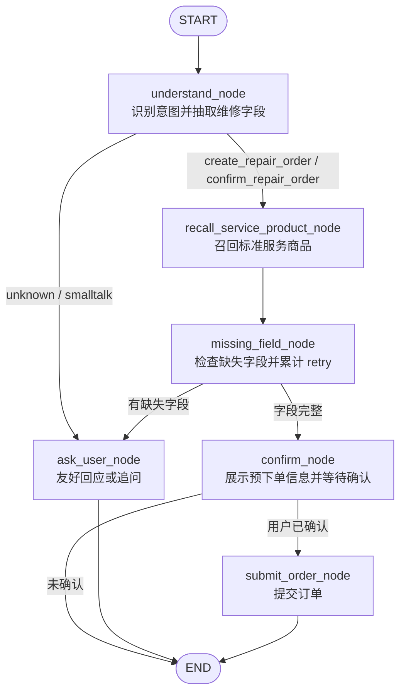

# LangGraph 订单工作流

```mermaid
flowchart TD
    START([START]) --> understand_node[understand_node<br/>识别意图并抽取维修字段]

    understand_node -->|create_repair_order / confirm_repair_order| recall_service_product_node[recall_service_product_node<br/>召回标准服务商品]
    understand_node -->|unknown / smalltalk| ask_user_node[ask_user_node<br/>友好回应或追问]

    recall_service_product_node --> missing_field_node[missing_field_node<br/>检查缺失字段并累计 retry]

    missing_field_node -->|有缺失字段| ask_user_node
    missing_field_node -->|字段完整| confirm_node[confirm_node<br/>展示预下单信息并等待确认]

    confirm_node -->|用户已确认| submit_order_node[submit_order_node<br/>提交订单]
    confirm_node -->|未确认| END([END])

    ask_user_node --> END
    submit_order_node --> END
```
